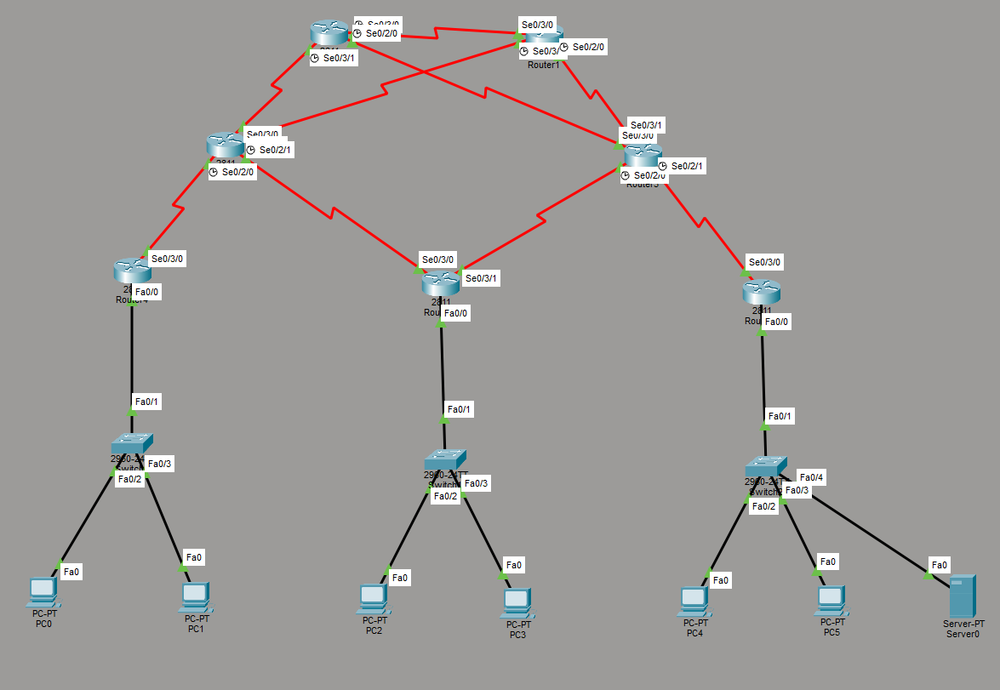

# ISP Network Simulation — Cisco Packet Tracer

A redundant ISP-grade network topology simulating real-world service provider infrastructure, designed and implemented using Cisco Packet Tracer. The project demonstrates multi-area OSPF routing, VLAN segmentation, inter-VLAN routing, DHCP, NAT, and ACL-based security policy across three customer sites.

---

## Network Topology Overview



The network consists of four layers:

**ISP Backbone (OSPF Area 0)**
- Two ISP Core Routers connected via a high-availability link
- Two ISP Edge Routers, each connected to both core routers for redundancy

**Customer Sites**
- Small Office (OSPF Area 1) — connected to ISP Edge R1
- Branch (OSPF Area 2) — connected to both Edge R1 and Edge R2 for failover
- Data Center (OSPF Area 3) — connected to ISP Edge R2

Each customer site uses a hierarchical design with a dedicated router and switch, with traffic segmented into separate VLANs.

---

## Technologies Implemented

| Technology | Details |
|---|---|
| Routing Protocol | OSPF Multi-Area (Areas 0, 1, 2, 3) |
| Redundancy | Dual ISP core and edge routers, dual WAN links on Branch site |
| VLAN Segmentation | Users, Management, Servers, DC-Servers per site |
| Inter-VLAN Routing | Router-on-a-Stick on all customer routers |
| IP Addressing | /30 WAN links, /24 LAN subnets |
| DHCP | Per-VLAN DHCP pools on all customer routers |
| NAT | PAT (overload) on both ISP edge routers |
| Security | Extended ACLs enforcing inter-site access control policy |

---

## VLAN Design

| Site | VLAN ID | Name | Subnet |
|---|---|---|---|
| Small Office | VLAN 10 | Users | 192.168.10.0/24 |
| Small Office | VLAN 20 | Management | 192.168.20.0/24 |
| Branch | VLAN 10 | Users | 192.168.30.0/24 |
| Branch | VLAN 30 | Servers | 192.168.40.0/24 |
| Data Center | VLAN 10 | Users | 192.168.50.0/24 |
| Data Center | VLAN 40 | DC-Servers | 192.168.60.0/24 |

---

## Security Policy (ACLs)

| Source | Destination | Action |
|---|---|---|
| Small Office Users (VLAN 10) | Data Center Servers | Denied |
| Small Office Management (VLAN 20) | Anywhere | Permitted |
| Branch Servers (VLAN 30) | Data Center Servers | Permitted |
| All Sites | Own Gateway | Permitted |

---

## Device Inventory

| Device | Hostname | Role |
|---|---|---|
| Router (2811) | ISP-Core-R1 | ISP Backbone Core |
| Router (2811) | ISP-Core-R2 | ISP Backbone Core |
| Router (2811) | ISP-Edge-R1 | ISP Edge / ABR |
| Router (2811) | ISP-Edge-R2 | ISP Edge / ABR |
| Router (2811) | Cust-R1-SmallOffice | Customer Site 1 |
| Router (2811) | Cust-R2-Branch | Customer Site 2 |
| Router (2811) | Cust-R3-DataCenter | Customer Site 3 |
| Switch (2960) | SW1-SmallOffice | Access Layer Site 1 |
| Switch (2960) | SW2-Branch | Access Layer Site 2 |
| Switch (2960) | SW3-DataCenter | Access Layer Site 3 |

---

## Key Features

- **Redundant ISP backbone** — dual core and edge routers ensure no single point of failure at the ISP level
- **Branch site failover** — Branch has two WAN links (primary via Edge R1, redundant via Edge R2) with automatic OSPF rerouting on failure
- **OSPF multi-area design** — scalable routing architecture separating ISP backbone from customer areas
- **Router-on-a-Stick** — single physical uplink per customer site carrying multiple VLANs via 802.1Q trunking
- **Per-VLAN DHCP** — automatic IP assignment for all end devices per VLAN
- **NAT overload (PAT)** — customer private IPs translated to public IPs at ISP edge
- **Extended ACLs** — granular inter-site traffic control enforcing security policy

---

## How to Open

1. Download and install **Cisco Packet Tracer 8.x** or later
2. Clone or download this repository
3. Open `ISP-Network-Topology.pkt` in Packet Tracer
4. Switch to **Realtime mode** to see live topology
5. Use the CLI on any device to inspect configurations

---

## Verification Tests

To verify the network is working correctly after opening:

**Test 1 — Cross-site connectivity:**
```
PC0> ping 192.168.30.2
```
Expected: Success — Small Office to Branch reachable via OSPF

**Test 2 — ACL blocking:**
```
PC0> ping 192.168.60.2
```
Expected: Fail — Small Office Users blocked from Data Center servers

**Test 3 — ACL allowing:**
```
PC3> ping 192.168.60.2
```
Expected: Success — Branch Servers allowed to reach Data Center servers

---

## Author

**K M Mazharul Haque**
BSc in Computer Science and Engineering — American International University Bangladesh

IT Infrastructure & Cybersecurity Intern — Goinnovior Limited

CCNA In Progress — Expected September 2026

🔗 [LinkedIn](https://www.linkedin.com/in/k-m-mazharul-haque)
📧 kmhaque.official@gmail.com
